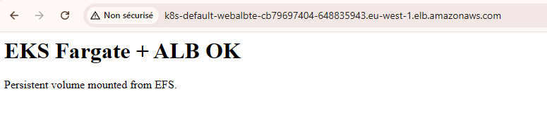

# Processus complet de déploiement AWS Landing Zone & Application (version actuelle)

Ce document reflète le fonctionnement validé actuellement:

- EKS sur Fargate,
- stockage persistant via EFS,
- exposition HTTP via Ingress + AWS Load Balancer Controller (ALB dynamique),
- sans ALB statique provisionné par Terraform.

## 1) Créer le compte AWS d'atterrissage

- Se connecter avec un compte parent/root.
- Aller dans `bootstrap-aws-account/`.
- Appliquer Terraform:

```sh
terraform init
terraform plan
terraform apply
```

- Noter:
  - `account_id`,
  - rôle `OrganizationAccountAccessRole`.

## 2) Assumer le rôle dans le nouveau compte

Configurer un profil assume-role puis exporter les credentials:

Vous pouvez trouver l'account_id avec terraform output sur le /bootstrap-aws-account

veuillez ajouter le [profile finaxys-lz] dans ~/.aws/config

```ini
[profile finaxys-lz]
role_arn = arn:aws:iam::<ACCOUNT_ID>:role/OrganizationAccountAccessRole
source_profile = default
region = eu-west-1
role_session_name = tf-bootstrap
```

```sh
eval "$(aws configure export-credentials --profile finaxys-lz --format env)"
aws sts get-caller-identity
```

## 3) Déployer l'infrastructure Terraform

Ordre:

1. `bootstrap-s3/`
2. `landing-zone/`

Dans chaque dossier:

```sh
terraform init
terraform plan
terraform apply
```

## 4) Accès kubectl au cluster EKS (auth + autorisation)

Mettre à jour kubeconfig:

```sh
aws eks update-kubeconfig \
  --name agentic-research-eks \
  --region eu-west-1 \
  --role-arn arn:aws:iam::<ACCOUNT_ID>:role/OrganizationAccountAccessRole
```

Donner les droits Kubernetes au rôle IAM (indispensable):

```sh
aws eks create-access-entry \
  --cluster-name agentic-research-eks \
  --region eu-west-1 \
  --principal-arn arn:aws:iam::<ACCOUNT_ID>:role/OrganizationAccountAccessRole

aws eks associate-access-policy \
  --cluster-name agentic-research-eks \
  --region eu-west-1 \
  --principal-arn arn:aws:iam::<ACCOUNT_ID>:role/OrganizationAccountAccessRole \
  --policy-arn arn:aws:eks::aws:cluster-access-policy/AmazonEKSClusterAdminPolicy \
  --access-scope type=cluster
```

Vérification:

```sh
kubectl get ns
```

## 5) Déployer l'image de test dans ECR

Depuis `test_manifest/`:

```sh
./docker_push.sh
```

Le script:

- pull une image DockerHub,
- login ECR,
- tag/push vers `ecr_repository_url`.

## 6) Déployer l'app test sur EKS Fargate

Depuis `test_manifest/`:

```sh
./deploy_manifest.sh
```

Le déploiement utilise:

- `manifest.yaml` (PV/PVC EFS + Deployment + Service + Ingress),
- l'image ECR pushée,
- l'exposition via ALB dynamique créée par l'Ingress.

## 7) Vérifications opérationnelles

```sh
kubectl get pods -A
kubectl get pvc,pv -n default
kubectl get ingress web-alb-test-ingress -n default -o wide
```

Récupérer l'URL ALB dynamique:

```sh
echo "http://$(kubectl get ingress web-alb-test-ingress -n default -o jsonpath='{.status.loadBalancer.ingress[0].hostname}')"
```

Test HTTP:

```sh
curl -I "http://$(kubectl get ingress web-alb-test-ingress -n default -o jsonpath='{.status.loadBalancer.ingress[0].hostname}')"
```

## Notes importantes

- Fargate + persistance => EFS (pas EBS pour pods applicatifs).
- `aws eks update-kubeconfig` n'accorde pas les droits RBAC à lui seul.
- Si `kubectl` répond `Unauthorized`, vérifier le principal AWS actif (`aws sts get-caller-identity`) et les access entries EKS.
- Si l'Ingress n'expose pas d'URL, vérifier `aws-load-balancer-controller` dans `kube-system`.

## Résultat visuel (équivalent du test `curl`)


